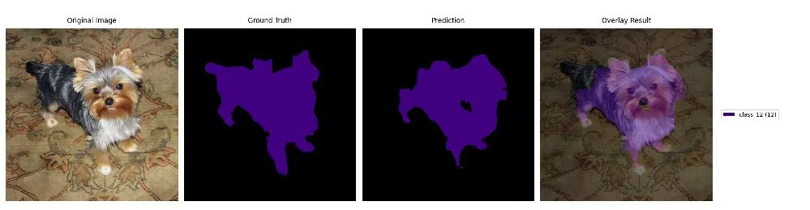

# DETR 简介

DETR（Detection Transformer）是一种基于Transformer的目标检测模型。它通过将目标检测问题转化为集合预测问题，简化了传统检测器的设计。DETR 具有端到端训练的优势，并且在复杂场景中表现出色。


## 参考训练结果

以下是使用 DETR 进行 5 个 epoch 训练后的结果示例：

<div align="center">
    
</div>


## 参考训练脚本

以下是使用 MYSEGX 框架进行 DETR 训练的参考脚本：

```python
"""测试 MYSEGX 简单训练脚本"""
import os
from pathlib import Path
from MYSEGX import train

def test_semantic_segmentation():
    """测试语义分割训练"""
    print("\n=== 测试语义分割训练 ===")
    history = train(
        config_path='configs/Semantic_Segmentation/detr/detr_r18.yaml',
        task_type='semantic',
        dataset='voc',
        dataset_root='datasets/VOC2012',  # 请替换为实际的VOC数据集路径
        model_name='detr',
        batch_size=8,  
        num_workers=8  
    )
    print("语义分割训练测试通过！")

if __name__ == '__main__':
    # 设置数据集路径
    voc_root = os.getenv('VOC_ROOT', 'datasets/VOC2012')  # 从环境变量获取或使用默认值
    if not os.path.exists(voc_root):
        print(f"警告: VOC数据集路径 {voc_root} 不存在")
        print("请设置正确的VOC_ROOT环境变量或直接修改脚本中的路径")
        exit(1)
        
    try:
        test_semantic_segmentation()
        print("\n所有测试完成！")
    except Exception as e:
        print(f"\n测试失败: {str(e)}")
        raise
```

请根据您的需求调整数据集路径和其他参数。